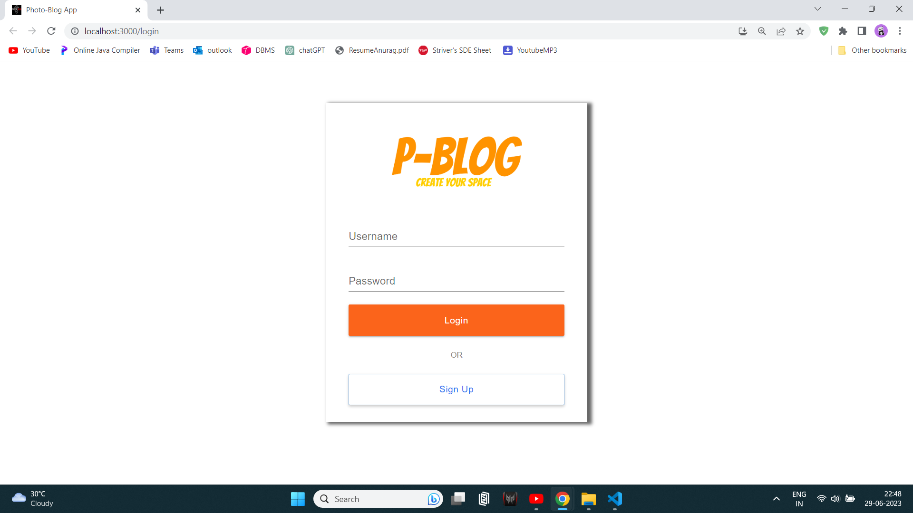
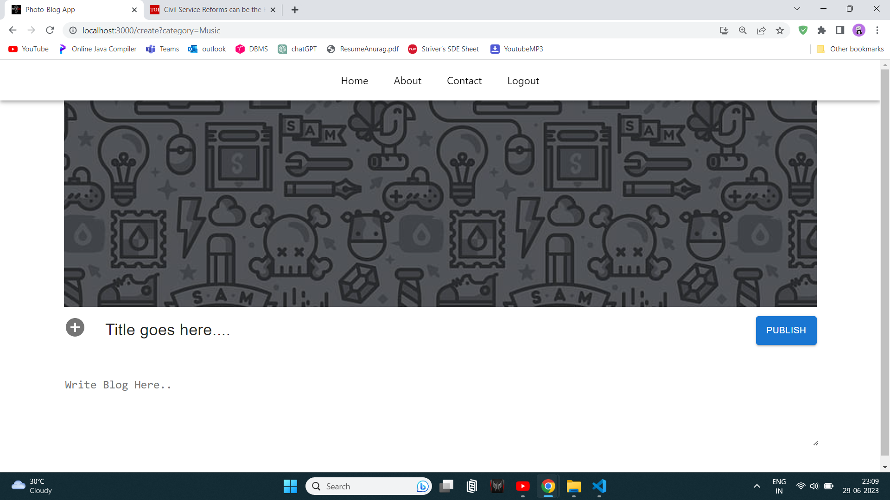

<!-- Improved compatibility of back to top link: See: https://github.com/othneildrew/Best-README-Template/pull/73 -->
<a name="readme-top"></a>
<!--
*** Thanks for checking out the Best-README-Template. If you have a suggestion
*** that would make this better, please fork the repo and create a pull request
*** or simply open an issue with the tag "enhancement".
*** Don't forget to give the project a star!
*** Thanks again! Now go create something AMAZING! :D
-->


<!-- PROJECT SHIELDS -->
<!--
*** I'm using markdown "reference style" links for readability.
*** Reference links are enclosed in brackets [ ] instead of parentheses ( ).
*** See the bottom of this document for the declaration of the reference variables
*** for contributors-url, forks-url, etc. This is an optional, concise syntax you may use.
*** https://www.markdownguide.org/basic-syntax/#reference-style-links
-->
[![Contributors][contributors-shield]][contributors-url]
[![Forks][forks-shield]][forks-url]
[![Stargazers][stars-shield]][stars-url]
[![Issues][issues-shield]][issues-url]
[![MIT License][license-shield]][license-url]
[![LinkedIn][linkedin-shield]][linkedin-url]


<!-- PROJECT LOGO -->
<br />
<div align="center">
  <a href="https://github.com/othneildrew/Best-README-Template">
    
  </a>

  <h3 align="center">Interactive Blog Application</h3>

  <p align="center">
    Create your space here!
    <br />
    <a href="https://github.com/AnuragKomrewar/BlogApp"><strong>Explore the docs »</strong></a>
    <br />
    <br />
    <a href="https://github.com/AnuragKomrewar/BlogApp">View Demo</a>
    ·
    <a href="https://github.com/AnuragKomrewar/BlogApp">Report Bug</a>
    ·
    <a href="https://github.com/AnuragKomrewar/BlogApp">Request Feature</a>
  </p>
</div>


<!-- TABLE OF CONTENTS -->
<details>
  <summary>Table of Contents</summary>
  <ol>
    <li>
      <a href="#about-the-project">About The Project</a>
      <ul>
        <li><a href="#features">Features</a></li>
        <li><a href="#technologies-used">Technologies Used</a></li>
      </ul>
    </li>
    <li><a href="#installation">Installation</a></li>
    <li><a href="#usage">Usage</a></li>
    <li><a href="#contributing">Contributing</a></li>
    <li><a href="#license">License</a></li>
    <li><a href="#contact">Contact</a></li>
  </ol>
</details>


<!-- ABOUT THE PROJECT -->
## About The Project

 &nbsp;
 &nbsp;
 &nbsp;
 &nbsp;
 &nbsp;
 &nbsp;
 &nbsp;

This is a blog application built using React.js, Node.js, Express, and MongoDB. It allows users to register and log in, create and modify blogs, and interact with other users through comments. The application also includes a category section where users can filter blogs based on specific categories.

### Features

- User authentication: Users can register and log in to the application to access its features.
- Home page: Displays all the blogs available in the application.
- Category filtering: Users can filter blogs based on categories of their choice.
- Create and modify blogs: Users can create new blogs and edit existing ones.
- Commenting system: Other users can leave comments on the blogs.

### Technologies Used

* [![React][React Badge]][React URL]
* [![Node.js][Node.js Badge]][Node.js URL]
* [![Express.js][Express.js Badge]][Express.js URL]
* [![MongoDB][MongoDB Badge]][MongoDB URL]
* [![Material-UI][Material-UI Badge]][Material-UI URL]
* [![JavaScript][JavaScript Badge]][JavaScript URL]
* [![HTML][HTML Badge]][HTML URL]
* [![CSS][CSS Badge]][CSS URL]
* [![JWT][JWT Badge]][JWT URL]

<p align="right">(<a href="#readme-top">back to top</a>)</p>

<!-- INSTALLATION -->
## Installation

1. Clone the repository:
   ```sh
   git clone https://github.com/AnuragKomrewar/BlogApp.git
2. Navigate to the project directory:
   ```sh
   cd BlogApp
## Install client dependencies
cd client
npm install
## Install server dependencies
cd ../server
npm install
## Configure the environment variables:

Create a .env file in the server directory.
Set the following environment variables in the .env file:
* MONGODB_URI=your-mongodb-uri
* SECRET_KEY=your-secret-key
  
## Start the development server:
### Start the server
cd server
npm start

### Start the client
cd ../client
npm start

Open your browser and navigate to http://localhost:3000 to see the blog application in action.

<!-- USAGE EXAMPLES -->
## Usage

* Register a new account or log in with existing credentials.
* Browse the home page to see all the blogs.
* Use the category section to filter blogs based on specific categories.
* Create a new blog by clicking on the "Create Blog" button.
* Edit or delete your own blogs by clicking on the corresponding buttons.
* Leave comments on other users' blogs.

_For more examples, please refer to the [Documentation](https://example.com)_

<p align="right">(<a href="#readme-top">back to top</a>)</p>


<!-- CONTRIBUTING -->
## Contributing

Contributions are what make the open source community such an amazing place to learn, inspire, and create. Any contributions you make are **greatly appreciated**.

If you have a suggestion that would make this better, please fork the repo and create a pull request. You can also simply open an issue with the tag "enhancement".
Don't forget to give the project a star! Thanks again!

1. Fork the Project
2. Create your Feature Branch (`git checkout -b feature/AmazingFeature`)
3. Commit your Changes (`git commit -m 'Add some AmazingFeature'`)
4. Push to the Branch (`git push origin feature/AmazingFeature`)
5. Open a Pull Request

<p align="right">(<a href="#readme-top">back to top</a>)</p>


<!-- LICENSE -->
## License

MIT License

This project is licensed under the terms of the MIT License.
You can find a copy of the license in the LICENSE file or visit
https://opensource.org/licenses/MIT.

© [2023] [Anurag Komrewar]
<p align="right">(<a href="#readme-top">back to top</a>)</p>


<!-- CONTACT -->
## Contact

Your Name - askomrewar@gmail.com

<p align="right">(<a href="#readme-top">back to top</a>)</p>


<!-- ACKNOWLEDGMENTS -->
## Acknowledgments

I would like to express my gratitude to the following individuals and resources that have contributed to the development of this project:

* [GitHub Pages](https://pages.github.com)
* [Font Awesome](https://fontawesome.com)
* [React Icons](https://react-icons.github.io/react-icons/search)

<p align="right">(<a href="#readme-top">back to top</a>)</p>


<!-- MARKDOWN LINKS & IMAGES -->
<!-- https://www.markdownguide.org/basic-syntax/#reference-style-links -->
[contributors-shield]: https://img.shields.io/github/contributors/othneildrew/Best-README-Template.svg?style=for-the-badge
[contributors-url]: https://github.com/AnuragKomrewar/BlogApp
[forks-shield]: https://img.shields.io/github/forks/othneildrew/Best-README-Template.svg?style=for-the-badge
[forks-url]: https://github.com/AnuragKomrewar/BlogApp
[stars-shield]: https://img.shields.io/github/stars/othneildrew/Best-README-Template.svg?style=for-the-badge
[stars-url]: https://github.com/AnuragKomrewar/BlogApp
[issues-shield]: https://img.shields.io/github/issues/othneildrew/Best-README-Template.svg?style=for-the-badge
[issues-url]: https://github.com/AnuragKomrewar/BlogApp
[license-shield]: https://img.shields.io/github/license/othneildrew/Best-README-Template.svg?style=for-the-badge
[license-url]: https://github.com/AnuragKomrewar/BlogApp
[linkedin-shield]: https://img.shields.io/badge/-LinkedIn-black.svg?style=for-the-badge&logo=linkedin&colorB=555
[linkedin-url]: https://www.linkedin.com/in/anurag-komrewar-93751a1b2/
[product-screenshot]: images/screenshot.png
[Next.js]: https://img.shields.io/badge/next.js-000000?style=for-the-badge&logo=nextdotjs&logoColor=white
[Next-url]: https://nextjs.org/
[React Badge]: https://img.shields.io/badge/React-v17.0.2-blue.svg?style=flat-square
[React URL]: https://reactjs.org/
[Vue.js]: https://img.shields.io/badge/Vue.js-35495E?style=for-the-badge&logo=vuedotjs&logoColor=4FC08D
[Vue-url]: https://vuejs.org/
[Angular.io]: https://img.shields.io/badge/Angular-DD0031?style=for-the-badge&logo=angular&logoColor=white
[Angular-url]: https://angular.io/
[Svelte.dev]: https://img.shields.io/badge/Svelte-4A4A55?style=for-the-badge&logo=svelte&logoColor=FF3E00
[Svelte-url]: https://svelte.dev/
[Laravel.com]: https://img.shields.io/badge/Laravel-FF2D20?style=for-the-badge&logo=laravel&logoColor=white
[Laravel-url]: https://laravel.com
[Bootstrap.com]: https://img.shields.io/badge/Bootstrap-563D7C?style=for-the-badge&logo=bootstrap&logoColor=white
[Bootstrap-url]: https://getbootstrap.com
[JQuery.com]: https://img.shields.io/badge/jQuery-0769AD?style=for-the-badge&logo=jquery&logoColor=white
[JQuery-url]: https://jquery.com 
[Node.js Badge]: https://img.shields.io/badge/Node.js-14.x-green.svg?style=flat-square
[Node.js URL]: https://nodejs.org/
[Express.js Badge]: https://img.shields.io/badge/Express.js-4.x-blue.svg?style=flat-square
[Express.js URL]: https://expressjs.com/
[MongoDB Badge]: https://img.shields.io/badge/MongoDB-4.x-orange.svg?style=flat-square
[MongoDB URL]: https://www.mongodb.com/
[Material-UI Badge]: https://img.shields.io/badge/Material--UI-v4.x-blue.svg?style=flat-square
[Material-UI URL]: https://material-ui.com/
[JavaScript Badge]: https://img.shields.io/badge/JavaScript-ES6-yellow.svg?style=flat-square
[JavaScript URL]: https://developer.mozilla.org/en-US/docs/Web/JavaScript
[HTML Badge]: https://img.shields.io/badge/HTML-5-orange.svg?style=flat-square
[HTML URL]: https://developer.mozilla.org/en-US/docs/Web/HTML
[CSS Badge]: https://img.shields.io/badge/CSS-3-blue.svg?style=flat-square
[CSS URL]: https://developer.mozilla.org/en-US/docs/Web/CSS
[JWT Badge]: https://img.shields.io/badge/JWT-Authentication-green.svg?style=flat-square
[JWT URL]: https://jwt.io/
